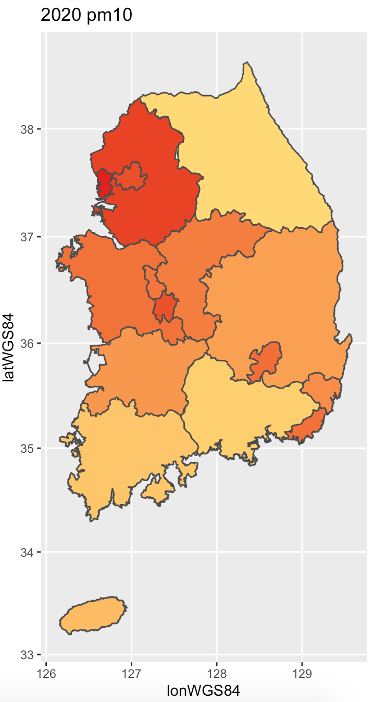
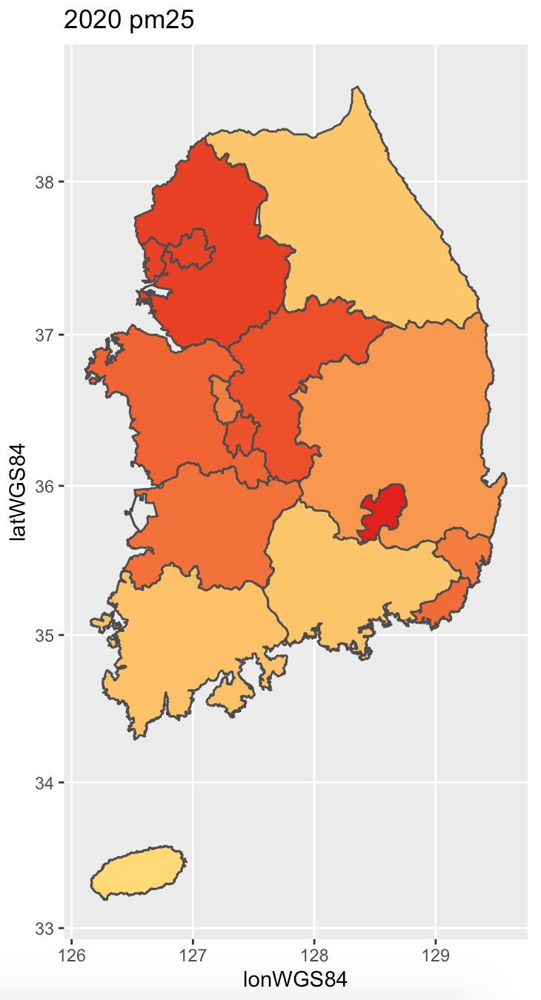
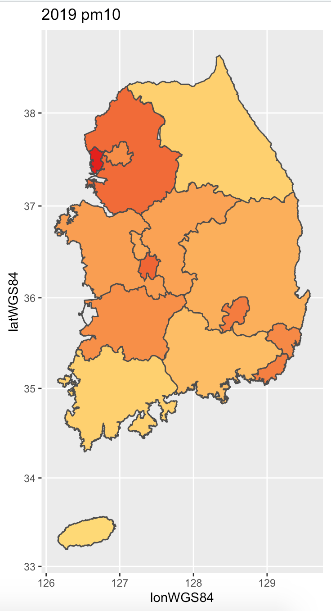
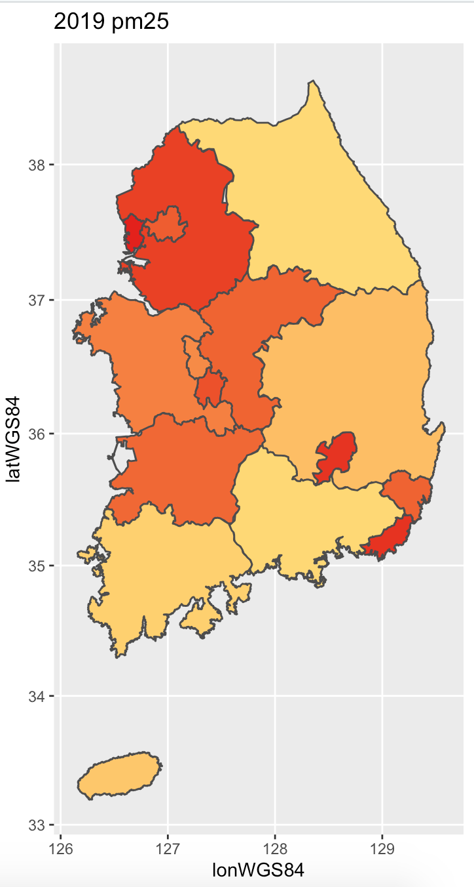
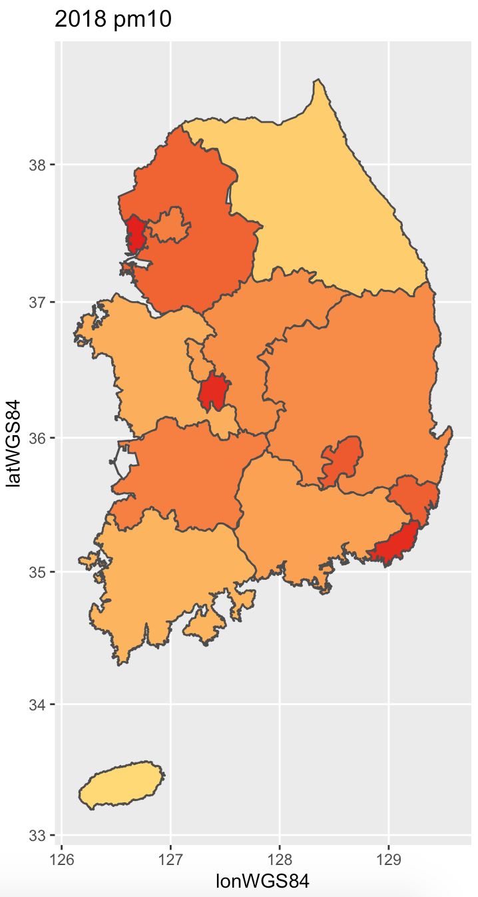
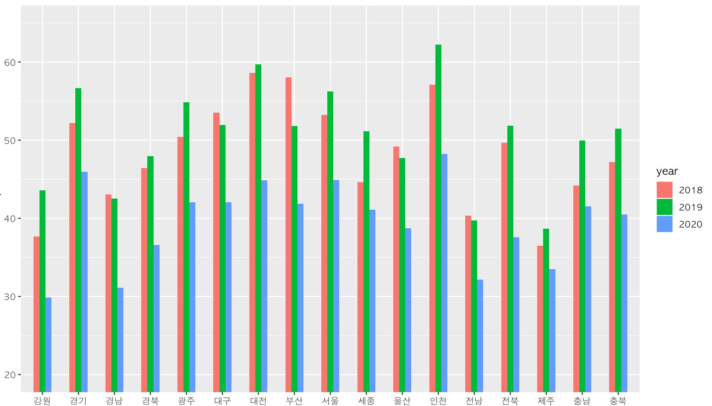
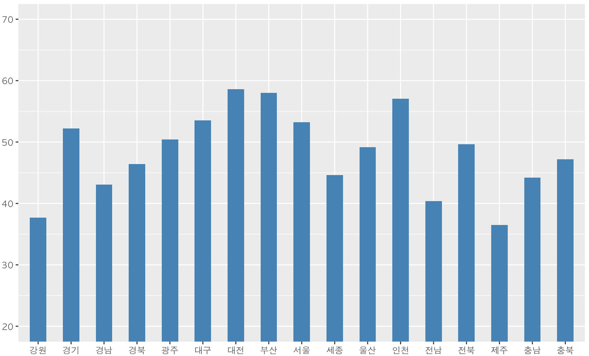
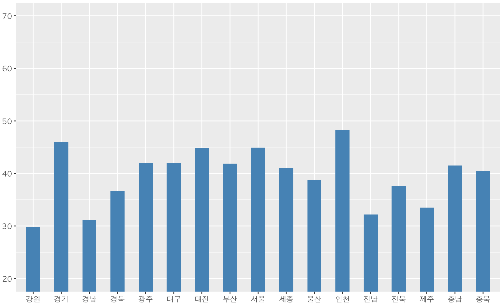

<h1 align="center">Capstone Project: BELL</h1>

  
  
  
  
  
  
  
   

  명지대학교 캡스톤 2020-1 프로젝트   
  미세먼지 데이터 분석하기

### 분석 항목  🗂

1. 내부 요인 : [우리나라 미세먼지 현황](#1번)
2. 내부 요인 : [서울시 교통량과 미세먼지 농도의 상관 관계](#2번)
3. 외부 요인 : [중국 미세먼지와 서울시 미세먼지 농도의 상관 관계](#3번)
4. 외부 요인 : [풍향과 서울시 미세먼지 농도의 상관 관계](#4번)

 

# 1번 분석항목 : 우리나라 미세먼지 현황

> contributor 👩‍💻 : [최은지](https://github.com/ChoiEunji0114)

## 데이터 수집

- [시/도별 미세먼지 데이터](https://aqicn.org/data-platform/register/kr/)
- [시/도별 행정 경계 (census) 데이터](https://sgis.kostat.go.kr/view/index)

## 🛠 1-1 분석 주제 : 시/도별 미세먼지 농도의 차이

- 우리나라의 총 162개의 도시의 데이터를 모두 일일이 수집하고 통계를 내는데에 무리가 있다고 판단, 일부 지역의 미세먼지 데이터 부재 등의 이유로 시/군/구 단위의 데이터 시각화 대신 시/도별 데이터 시각화를 하기로 함.

- 도 단위의 데이터는 인구 상위 5개의 도시의 데이터를 사용하기로 함

    - 서울특별시
    - 부산광역시
    - 대구광역시
    - 인천광역시
    - 광주광역시
    - 대전광역시
    - 울산광역시
    - 세종특별자치시
    - 경기도 : 수원, 고양, 용인, 성남, 부천
    - 강원도 : 원주, 춘천, 강릉, 동해, 속초
    - 충청북도 : 청주, 충주, 제천, 음성, 진천
    - 충청남도 : 천안, 아산, 서산, 당진, 논산
    - 전라북도 : 전주, 익산, 군산, 정읍, ~~완주~~ 👉김제 (dataset 없음)
    - 전라남도 : 여수, 순천, 목포, 광양, ~~나주~~ 👉 무안 (dataset 없음)
    - 경상북도 : 포항, 경주, 김천, 안동, 구미
    - 경상남도 : 창원, 김해, 양산, 진주, 거제
    - 제주특별자치도
    
### 분석 결과

1. 2020 미세먼지, 초미세먼지 데이터

 

2. 2019 미세먼지, 초미세먼지 데이터

 

3. 2018 미세먼지, 초미세먼지 데이터

 
    
### 결론 

1. 서쪽 지역의 미세먼지 농도가 훨씬 높다.    
이는 중국의 미세먼지 영향, 북서풍의 영향인 **외부 요인** 이 작용한 것으로 추측된다.

2. 그럼에도 불구하고 **부산, 울산, 대구 (산업 발달 지역)** 는 수도권 지역 못지 않게 미세먼지 농도가 매우 높다.   
위 지역들은 중국의 외부요인 말고 다른 **내부 요인** 이 작용한 것으로 추측된다.

3. 지역별 농도의 차이는 미세먼지보다 **초미세먼지** 에서 더 두드러짐

> 10 마이크로미터보다 작은 입자는 '미세먼지', 2.5 마이크로미터보다 작은 입자는 '초미세먼지' 라고 불림.   
초미세먼지의 경우 자동차, 화력발전소 등에서 배출된 1차 오염물질의 대기 중 반응에 의한 2차 오염 물질생성이 주요 발생원이다.

즉, 전체적으로 중국의 미세먼지가 크게 작용하지만, 우리나라의 오염물질에 의한 내부 요인도 무시할 수 없다.

 
    
## 🛠 1-2 분석 주제 : 연도별 미세먼지 농도의 차이

2020년의 미세먼지 데이터는 1 ~ 4월만 존재하므로 (데이터 수집 2020년 5월 기준)   
각 연도의 1월 ~ 4월 미세먼지 데이터만 뽑아 그래프를 그려보았다.

### 분석 결과

1. 2018년, 2019년, 2020년 미세먼지 농도 그래프

2. 2018년, 2019년, 2020년 그래프 

  

### 결론
 2020년의 미세먼지 농도는 2019년, 2018년에 비해 확연히 낮다.   
이는 2020년 초, 코로나의 영향으로 중국의 공장 가동률이 낮았기 때문이라고 추측이 가능하다.   

따라서, 우리나라 미세먼지의 농도는 중국의 영향을 많이 받는다고 추측할 수 있다. 
      
    
## 💡 1번 최종 결론

웅앵..

 

# 2번 분석항목 : 서울시 교통량과 미세먼지 농도의 상관 관계

> contributor 👩‍💻 : [이지우]()

 

# 3번 분석항목 : 중국 미세먼지와 서울시 미세먼지 농도의 상관 관계

> contributor 👩‍💻 : [임혜진]()

## 분석 항목
1. 중국 도시의 미세먼지 농도는 서울 미세먼지 농도 증가에 영향을 미치는가? 
  * 중국 산동성 16개의 도시와 베이징, 상하이의 미세먼지 농도는 서울 미세먼지 농도에 영향을 미치는가?
  * 중국 산동성 16개의 도시의 미세먼지 농도는 서울 미세먼지 농도에 영향을 미치는가?
  * 중국 베이징의 미세먼지 농도는 서울 미세먼지 농도에 영향을 미치는가?
  * 중국 상하이의 미세먼지 농도는 서울 미세먼지 농도에 영향을 미치는가?
  * 서풍이 서울 미세먼지 농도에 영향을 미치는가?

## 데이터 수집
[중국 & 서울 미세먼지 데이터](https://aqicn.org/data-platform/register/kr/)

## 데이터 분석
1. 중국의 모든 도시가 서울 미세먼지에 연관되어 있지 않을 것이라고 판단하여 우리나라와 지리적으로 가까운 중국의 산동성에 해당하는 16개의 도시와 베이징, 상하이의 미세먼지 데이터를 이용하여 분석
2. 분석에 들어가기 앞서, pm10(미세먼지)에 결측치가 있는 것으로 보여 그 전날의 미세먼지 농도를 결측치에 넣어줌
3. R에서 테이블을 outer join과 grouping 하는 과정에서 생긴 결측치들은 제거한 뒤 분석을 진행하였음

## 분석 결과

### 1. 중국 18개의 도시의 미세먼지와 서울 미세먼지 분석

#### 1-1. 산점도
 
   

#### 1-2. 연도별 및 1월부터 4월까지 그래프
 
  
 
#### 1-3. 월별 그래프
 
  
 
#### 1-4. 연도별 1월부터 4월까지 그래프
 
  

### 2. 중국 산동성의 미세먼지와 서울 미세먼지 분석

#### 2-1. 산점도
 
  
 
### 2-2. 월별 그래프
 
  

#### 2-3. 연도별 1월부터 4월 그래프
 
  

### 3. 중국 베이징의 미세먼지와 서울 미세먼지 분석

#### 3-1. 산점도
 
  

#### 3-2. 월별 그래프
 
  

#### 3-3. 연도별 1월부터 4월 그래프
 
  

### 4. 중국 상하이의 미세먼지와 서울 미세먼지 분석
 
#### 4-1. 산점도
 
  

#### 4-2. 월별 그래프
 
  
 
#### 4-3. 연도별 1월부터 4월 그래프
 
  
  
### 5. 서풍과 중국 & 서울의 미세먼지 분석

## 결과
1. 중국 18개의 도시의 미세먼지와 서울 미세먼지의 상관관계를 분석한 결과 뚜렷한 양의 상관관계를 보였음
2. 중국 산동성의 미세먼지와 서울 미세먼지의 상관관계를 분석한 결과 뚜렷한 양의 상관관계를 보였음
3. 중국 베이징의 미세먼지와 서울 미세먼지의 상관관계를 분석한 결과 뚜렷한 양의 상관관계를 보였음
4. 중국 상하이의 미세먼지와 서울 미세먼지의 상관관계를 분석한 결과 뚜렷한 양의 상관관계를 보였음
5. 서풍과 서울 미세먼지의 상관관계를 분석한 결과 뚜렷한 양의 상관관계를 보였음

 

# 4번 분석항목 : 풍향과 서울시 미세먼지 농도의 상관 관계

> contributor 👩‍💻 : [김보영]()

## 데이터 수집

- [종관기상관측(ASOS)](https://data.kma.go.kr/data/grnd/selectAsosRltmList.do?pgmNo=36&tabNo=1) : 종관기상관측이란 종관규모의 날씨를 파악하기 위하여 정해진 시각에 모든 관측소에서 같은 시각에 실시하는 지상관측을 말함.
  - 제공 요소: 시간대별 기온, 습도, 기압, 지면온도, 풍향, 풍속, 일조
- [황사관측(PM10)](https://data.kma.go.kr/data/climate/selectDustRltmList.do?pgmNo=68) : 미세먼지 등 대기 중에 부유하는 에어로졸 중 직경이 10㎛ 이하인 입자의 농도를 관측한 자료
  - 제공 요소: 시간대별 미세먼지 농도
  
## 데이터 분석

### 1. 풍향이 미세먼지 농도에 영항을 미치는가?

- 2014년부터 2020년까지의 서울 기상관측소에서 측정된 풍향 데이터와 미세먼지 농도 데이터를 이용하여 풍향이 미세먼지 농도에 영향을 미치는지 알아보고 시각화함.
- 이를 위해 기상청 기상자료개방포털에서 해당 데이터를 1년 단위로 수집함. 종관기상관측(ASOS) 데이터에서는 풍향 데이터만 사용함. 
- 풍향 데이터와 미세먼지 데이터 모두 한시간마다 측정된 데이터임.
- 풍향 데이터는 숫자(각도)로 표현되어 있었기 때문에 16방위 풍향에 맞는 문자로 바꿔줌 (예: 270 -> N)
- 미세먼지 데이터에서 결측값이 상당수 있었기 때문에 미세먼지 데이터 전처리 실시함. 결측값은 하루동안의 평균 미세먼지 농도로 대체하였음.
- 년도별, 풍향별로 미세먼지 농도의 평균을 집계하여 그래프로 나타냄

## 분석 결과

- 2014년 풍향별 미세먼지 농도

- 2015년 풍향별 미세먼지 농도

- 2016년 풍향별 미세먼지 농도

- 2017년 풍향별 미세먼지 농도

- 2018년 풍향별 미세먼지 농도

- 2019년 풍향별 미세먼지 농도

- 2020(1월~4월)년 풍향별 미세먼지 농도

- 전체 기간 동안 미세먼지 농도가 100㎍/㎥ 이상일 때의 풍향을 나타낸 그래프

*WHO 기준 미세먼지 농도가 100㎍/㎥ 이상일 때 '매우 나쁨'임*

- 서풍 계열 바람의 비율이 절반 이상을 차지하고 있는 것을 알 수 있다.

### 2. 계절이 풍향과 미세먼지 농도에 영항을 미치는가?

- 2014년~2019년 6년동안 미세먼지 농도가 50㎍/㎥ 이하일 때('보통')와 100㎍/㎥ 초과일 때('매우 나쁨')의 주풍향을 그래프로 나타내었다.

## 분석결과

- 봄철 미세먼지 농도가 50㎍/㎥ 이하일 때의 주풍향 / 미세먼지 농도가 100㎍/㎥ 초과일 때의 주풍향

- 여름철 미세먼지 농도가 50㎍/㎥ 이하일 때의 주풍향 / 미세먼지 농도가 100㎍/㎥ 초과일 때의 주풍향

- 가을철 미세먼지 농도가 50㎍/㎥ 이하일 때의 주풍향 / 미세먼지 농도가 100㎍/㎥ 초과일 때의 주풍향

- 겨울철 미세먼지 농도가 50㎍/㎥ 이하일 때의 주풍향 / 미세먼지 농도가 100㎍/㎥ 초과일 때의 주풍향

## 결론

- 우리나라는 1년 내내 편서풍의 영향을 받으므로 4계절 모두 서풍의 비율이 대체로 높게 나타나긴 함
- 미세먼지 농도가 50㎍/㎥ 이하일 때는 동풍 계열 바람의 비율이 100㎍/㎥ 초과일 때와 비교하여 비교적 높게 나타남
- 미세먼지 농도가 100㎍/㎥ 초과일 때는 서풍 계열 바람이 주풍향으로 나타남

* * *

## 상관 관계 분석

- 앞선 분석에서 서풍 계열 바람이 불 때 미세먼지 농도가 높게 나타난다는 것을 알게 되었다.
- 따라서 상관 관계 분석을 진행하기 위해 미세먼지 농도에 가장 영향을 높게 주는 것으로 나타난 서풍과 서북서풍에 변수를 '2'로, 나머지 서풍 계열에 변수를 '1'로, 그 외 나머지 풍향에 변수를 '0'으로 주었다.
- 이런 방식으로 부여한 풍향의 변수를 일자별로 count하여 하루동안 서풍이 얼마나 불었는지를 나타내었고, 일자별로 평균 미세먼지 농도도 집계하였다.
- 이렇게 해서 풍향과 미세먼지 농도와의 상관 관계 분석을 해보았다.

- 풍향 & 미세먼지 상관계수: 

  - 위와 같이 상관계수가 약 0.22로 약한 양적 선형관계가 있는 것으로 나타남

- 산점도:

## 결론

- 대체로 서풍이 많이 불 수록 미세먼지 농도가 높아진다는 것을 알 수 있다.

