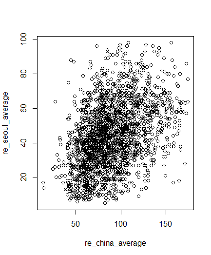

분석 정리
------------------
> Contributor : 임혜진

분석 항목
-------------------
1. 중국 도시의 미세먼지 농도는 서울 미세먼지 농도 증가에 영향을 미치는가
  * 중국 산동성 16개의 도시와 베이징, 상하이의 미세먼지 농도는 서울 미세먼지 농도에 영향을 미치는가
  * 중국 산동성 16개의 도시의 미세먼지 농도는 서울 미세먼지 농도에 영향을 미치는가
  * 중국 베이징의 미세먼지 농도는 서울 미세먼지 농도에 영향을 미치는가
  * 중국 상하이의 미세먼지 농도는 서울 미세먼지 농도에 영향을 미치는가

데이터 수집
--------------------
[중국 & 서울 미세먼지 데이터](https://aqicn.org/data-platform/register/kr/)

데이터 분석
--------------------
1. 중국의 모든 도시가 서울 미세먼지에 연관되어 있지 않을 것이라고 판단하여 우리나라와 지리적으로 가까운 중국의 산동성에 해당하는 16개의 도시와 베이징, 상하이의 미세먼지 데이터를 이용하여 분석
2. 분석에 들어가기 앞서, pm10(미세먼지)에 결측치가 있는 것으로 보여 그 전날의 미세먼지 농도를 결측치에 넣어줌
3. R에서 테이블을 outer join하고 grouping 하는 과정에서 생긴 결측치들은 제거한 뒤 분석을 진행하였음

분석 결과
---------------------

